# AI Financial Services Implementation

[](https://github.com/sjaramillov/ai-financial-services-implementation/actions/workflows/verify.yml)
[Licencia: Apache 2.0](LICENSE)

Controles para diseñar, evaluar y operar soluciones de IA en servicios financieros. Un repositorio educativo con tablero, simulación local, arquitectura conceptual, arquitectura objetivo y una base de infraestructura como código.

[](board/README.md)

*Vista del tablero. [Consultar el recorrido y sus controles](board/README.md).*

**Principio central:** el modelo propone; el dominio autoriza y registra el efecto. La aprobación humana complementa los controles de identidad, política y estado de la operación.

## Recorrido

1. Abrir el [Tablero](board/index.html) para presentar el problema y recorrer los controles.
2. Ejecutar la [demo local](demo/index.html) siguiendo el [ejercicio documentado](demo/README.md).
3. Explorar las [arquitecturas interactivas y el modelo ArchiMate](architecture/README.md).
4. Revisar la [matriz de controles](docs/controls.md), las [amenazas](docs/threat-model.md) y los [criterios para un piloto](docs/acceptance.md).
5. Consultar [Terraform y sus valores a reemplazar](infra/terraform/README.md).

GitHub muestra el código de los HTML. Para interactuar, clonar y abrirlos localmente o servir el directorio:

```sh
git clone https://github.com/sjaramillov/ai-financial-services-implementation.git
cd ai-financial-services-implementation
python3 -m http.server 8080 --bind 127.0.0.1
```

Abrir [el tablero local](http://localhost:8080/board/). El servidor sólo publica archivos del repositorio en el equipo local. No necesita credenciales ni invoca modelos.

## Dos ejercicios, alcances distintos

| Ejercicio | Estado en este repositorio | Pregunta que responde |
|---|---|---|
| Operaciones asistidas | Simulador determinista local, con casos sintéticos | ¿Qué debe impedir una acción inválida, duplicada o basada en evidencia vencida? |
| AI Evaluation Lab | Diseño conceptual documentado | ¿Cómo comparar candidatos de IA de manera reproducible, con aislamiento y limpieza verificable? |

El [laboratorio de evaluación](docs/evaluation-lab.md) cubre el ciclo aprovisionar → ejecutar → evaluar → destruir. No está implementado ni desplegado. La demo de operaciones no representa un benchmark de modelos.

## Arquitectura y evidencia

Las vistas usan aliases como `cuenta1`, `region-1` y `az-1`. Son propuestas generales y no un inventario de infraestructura. El modelo ArchiMate es un artefacto editable separado de los visores HTML generados con Archify.

Terraform implementa únicamente la base descrita en su README. No despliega toda la arquitectura objetivo. Sus ejemplos exigen reemplazar los valores `CHANGE_*`; no incluyen estado, inventarios ni identificadores de recursos existentes.

La [declaración de alcance](docs/scope-and-evidence.md) diferencia comportamiento simulado, configuración, propuesta y validación pendiente. Las [fuentes](docs/references.md) sustentan el diseño; no equivalen a una certificación ni a una evaluación de cumplimiento regulatorio.

## Verificación local

Requisitos: Python 3.11+ y Node.js 22+. Terraform es opcional para revisar la base de infraestructura.

```sh
node --test tests/*.test.cjs
python3 scripts/check_publication.py
python3 scripts/check_links.py
python3 scripts/check_architecture.py
```

Para los comandos de validación de arquitectura y Terraform, ver los README de cada directorio. El [informe de validación](docs/validation.md) registra lo efectivamente ejecutado.

## Organización

| Directorio | Contenido |
|---|---|
| `board/` | Tablero de controles y recorrido de presentación |
| `demo/` | Simulador, código fuente y guía del ejercicio |
| `architecture/` | JSON, HTML interactivos, ArchiMate y evidencias de validación |
| `docs/` | Controles, decisiones, amenazas, evaluación y criterios de aceptación |
| `infra/terraform/` | Base educativa parametrizada, sin conexión al core |
| `tests/`, `scripts/` | Pruebas del simulador y verificaciones de publicación |

Los datos de los ejercicios son sintéticos. Este repositorio no presta servicios financieros ni ejecuta operaciones reales.

## Licencia

Copyright 2026 Sebastian Jaramillo Valderrama. El material propio de este repositorio —código, documentación, diagramas y configuración Terraform— se distribuye bajo [Apache License 2.0](LICENSE). Ver también [NOTICE](NOTICE).

Los componentes de terceros conservan sus licencias y avisos:

- El código del visor generado con Archify conserva su [licencia MIT](architecture/ARCHIFY-LICENSE.txt).
- Las tipografías Bricolage Grotesque, Atkinson Hyperlegible y Archivo conservan [SIL Open Font License 1.1](board/assets/fonts/FONT-LICENSES.txt), incluidas las copias incrustadas en `board/preview.svg`.

Apache 2.0 no sustituye esas licencias. Las contribuciones deben respetar este alcance; consultar [CONTRIBUTING.md](CONTRIBUTING.md).
